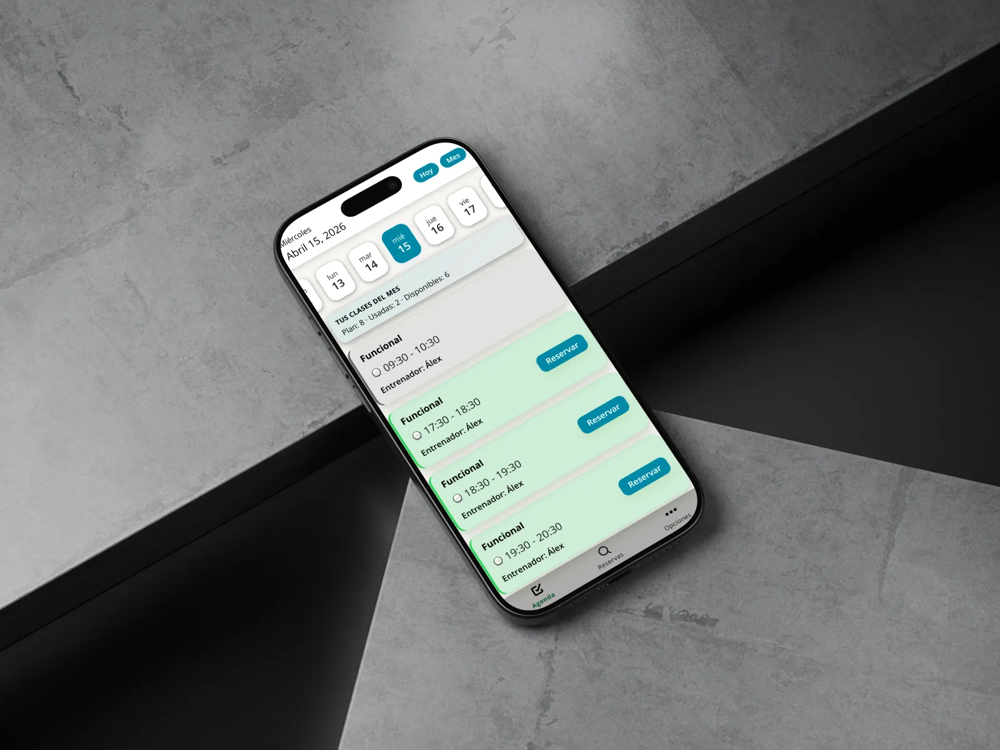
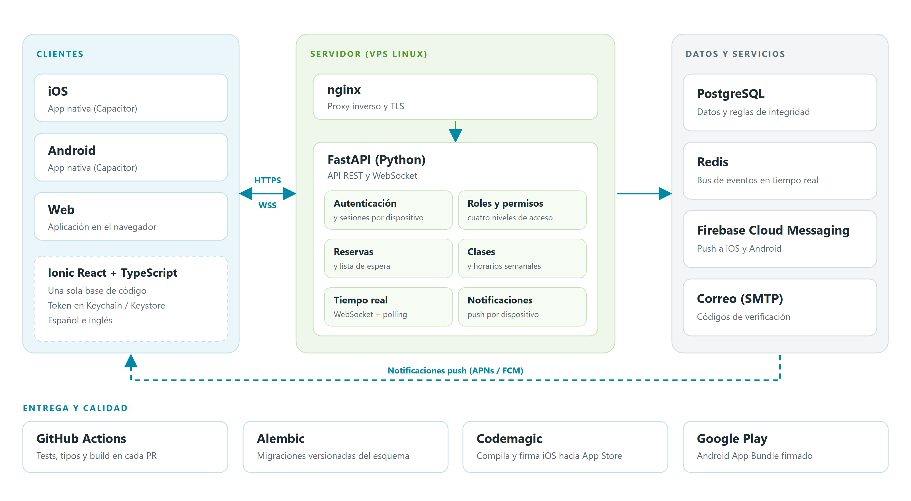

  

# Alesport

Aplicación de gestión de clases y reservas para un centro deportivo. Reúne en una sola plataforma a alumnos, entrenadores y administradores: los alumnos reservan clase desde el móvil y el equipo del centro gestiona horarios, aforos, planes y asistentes en tiempo real.

> Este repositorio es un escaparate del proyecto: contiene documentación e imágenes, **sin código**. El código fuente es privado porque la aplicación está en producción con usuarios reales.

  
   
  <em>Agenda del alumno: clases del día, plan mensual y reserva con un toque.</em>

---

## Estado del proyecto

| Aspecto | Detalle |
|---|---|
| **Plataformas** | iOS (App Store), Android (prueba cerrada en Google Play) y web |
| **Producción** | En uso real por los alumnos y el equipo del centro |
| **Desarrollo** | Desde marzo de 2026, en evolución y mantenimiento continuos |
| **Mi papel** | Diseño y desarrollo completos: API, base de datos, app móvil, despliegue y CI/CD |

---

## Funcionalidades

### Para alumnos

- Agenda semanal y mensual de clases, con el aforo y el estado de cada una a la vista.
- Reserva y cancelación desde el móvil, con el contador del plan mensual (clases usadas y disponibles).
- **Lista de espera automática**: si la clase está llena, el alumno entra en cola y, cuando se libera una plaza, recibe una oferta con tiempo limitado para confirmarla, avisada por notificación push.
- Sección de reservas propia, con consulta por meses.
- Notificaciones push cuando una clase se cancela o se libera una plaza.
- Perfil con foto y teléfono, normas del centro, idioma (español e inglés) y gestión de los dispositivos con sesión abierta.
- Eliminación de la cuenta desde la propia app.

### Para entrenadores y administradores

- Calendario de gestión con clases y reservas actualizadas en tiempo real.
- Creación de clases sueltas, **clases recurrentes** a partir de un horario semanal y copia de una semana anterior.
- Edición y cancelación de clases, con aviso automático a todos los apuntados.
- **Alumnos fijos** en clases recurrentes: sus reservas se generan solas.
- Gestión de clientes: plan mensual, membresía activa o inactiva, bloqueo y desbloqueo de cuentas.
- Edición de las normas del centro.

### Transversal

- Cuatro roles con permisos diferenciados: superadministrador, administrador, entrenador y cliente.
- Verificación del correo y recuperación de contraseña mediante código.
- Sesiones independientes por dispositivo: se puede cerrar sesión en uno concreto sin afectar a los demás.
- Interfaz completa en español e inglés.

---

## Reglas de negocio destacadas

La parte más interesante del proyecto no es la pantalla, sino las reglas que hay detrás.

| Regla | Cómo se resuelve |
|---|---|
| **Un único espacio físico** | Nunca puede haber dos clases a la vez, sin importar qué entrenador las imparta. Se garantiza en la aplicación y, además, en la propia base de datos. |
| **Plan mensual** | Cada alumno tiene un cupo de clases al mes, que se cuenta contra el mes de la clase y no contra el de la reserva. |
| **Lista de espera con ofertas** | Se respeta el orden de llegada. La oferta caduca a los 15 minutos, se salta a quien no puede aceptarla (sin cupo o sin membresía) y se reparten tantas ofertas como plazas libres haya. |
| **Cancelación** | Soltar una plaza confirmada exige antelación; salir de la cola o rechazar una oferta es posible siempre, porque libera plaza en lugar de retenerla. |
| **Pérdida de acceso** | Quitar la membresía o bloquear una cuenta cancela sus reservas futuras y libera las plazas para la cola. |
| **Hora de las clases** | La hora de una clase es la del centro, no la del móvil de quien la mira, incluidos los cambios de hora de primavera y otoño. |
| **Privacidad entre entrenadores** | Cada entrenador solo ve quién asiste a sus propias clases. |
| **Cuenta bloqueada** | Solo puede cerrar sesión o eliminar su cuenta: no queda encerrada sin salida. |

---

## Tecnologías

| Área | Tecnología |
|---|---|
| App móvil y web | Ionic React, React, TypeScript, Vite |
| Nativo iOS y Android | Capacitor |
| API | Python, FastAPI, SQLAlchemy, Pydantic |
| Base de datos | PostgreSQL, migraciones con Alembic |
| Tiempo real | WebSocket y Redis (publicación y suscripción de eventos) |
| Autenticación | JWT, bcrypt, almacenamiento seguro nativo (Keychain en iOS, Keystore en Android) |
| Notificaciones push | Firebase Cloud Messaging (APNs en iOS) |
| Correo | SMTP asíncrono |
| Calidad | pytest, Vitest, flake8, comprobación de tipos |
| CI/CD | GitHub Actions y Codemagic |
| Infraestructura | VPS Linux, nginx, TLS |

---

## Arquitectura

  

- Un único cliente en Ionic React, empaquetado como app nativa con Capacitor para iOS y Android y publicado también como web.
- La lógica de negocio vive en una capa de servicios independiente de los endpoints: las rutas validan y delegan.
- PostgreSQL es la fuente de verdad. Sus restricciones de integridad respaldan las reglas de la aplicación, y el esquema evoluciona con migraciones versionadas.
- El tiempo real usa WebSocket con tickets de un solo uso; Redis distribuye los eventos entre procesos y un refresco periódico cubre los huecos si la conexión se cae.
- En el cliente hay una única conexión por app, con reconexión progresiva para no saturar al servidor cuando está caído.
- Las notificaciones push se asocian a cada dispositivo y no a cada persona, y los tokens muertos se limpian solos.

---

## Ingeniería y calidad

- **Más de 1.400 tests automáticos** entre backend y frontend.
- **Integración continua en cada Pull Request**: tests del backend contra PostgreSQL real, una prueba de humo que arranca el servidor y ejerce la API de extremo a extremo, y en el frontend tests, comprobación de tipos y compilación.
- **Comprobaciones que impiden errores de despliegue conocidos**, por ejemplo que una compilación de tienda apunte por error a un servidor de desarrollo, o que el entorno de notificaciones del binario de iOS sea el de producción.
- **Auditorías técnicas periódicas** de seguridad, rendimiento y lógica de negocio. Cada hallazgo se reproduce antes de corregirlo y queda cubierto por un test que falla si el problema vuelve a aparecer.
- **Rendimiento medido, no supuesto**: por ejemplo, la carga de las reservas de un calendario de unas cuarenta clases pasó de más de doscientas consultas a la base de datos a tres.
- **Zonas horarias verificadas**: los tests recorren las 8.760 horas de un año completo para comprobar que la hora de cada clase se resuelve igual en cualquier dispositivo.
- **Accesibilidad**: la interfaz respeta el tamaño de letra configurado en el sistema sin romper el diseño.

---

## Seguridad

- Contraseñas con hash y JWT vinculado a una sesión por dispositivo, revocable en cualquier momento.
- El token se guarda en el almacenamiento seguro del sistema operativo, nunca en texto plano.
- Límite de intentos en el inicio de sesión, el registro y los códigos de verificación.
- Códigos de un solo uso con caducidad para verificar el correo y recuperar la contraseña.
- Permisos comprobados siempre en el servidor, no solo en la interfaz.
- Datos personales mínimos en cada respuesta: cada pantalla recibe solo lo que necesita.

---

## Publicación y despliegue

| Destino | Cómo se publica |
|---|---|
| iOS | Compilación y firma automáticas en Codemagic, con subida a App Store Connect |
| Android | Android App Bundle firmado, distribuido a través de Google Play |
| Web | Aplicación estática servida por nginx |
| API | VPS Linux con nginx como proxy inverso y TLS, con migraciones controladas |

---

## Código fuente

El repositorio con el código es privado, ya que la aplicación está en producción y contiene lógica y configuración de un negocio real. Si quieres conocer más a fondo cómo está construida, puedo enseñarlo en una revisión guiada: escríbeme.

---

## Autor

Desarrollado por **Verdeguer Labs** · [@Teslol89](https://github.com/Teslol89)

- Web: [www.verdeguerlabs.es](https://www.verdeguerlabs.es)
- Email: [info@verdeguerlabs.es](mailto:info@verdeguerlabs.es)

---

## Licencia

Todos los derechos reservados. Este repositorio contiene únicamente documentación e imágenes de presentación y no concede ninguna licencia sobre el software. El nombre y el logotipo de Alesport pertenecen a sus titulares.
